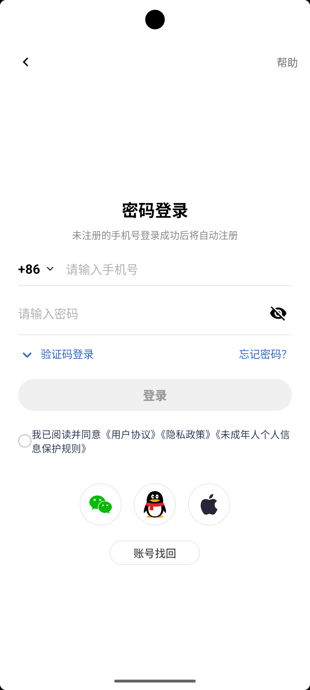
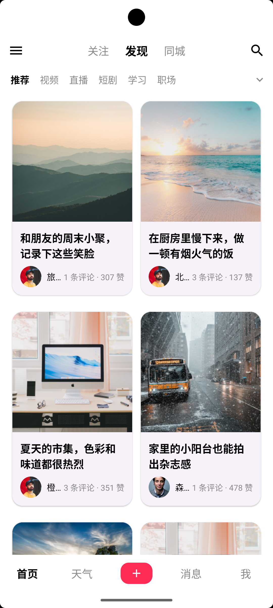
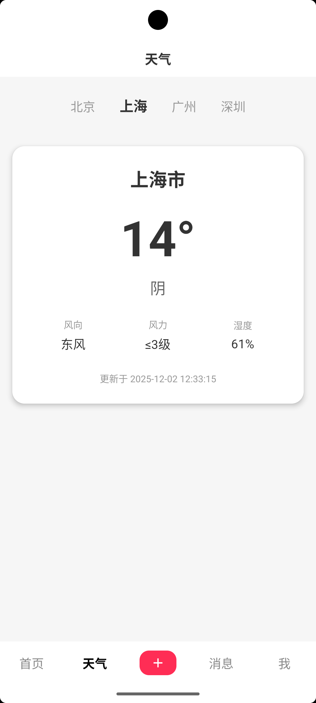
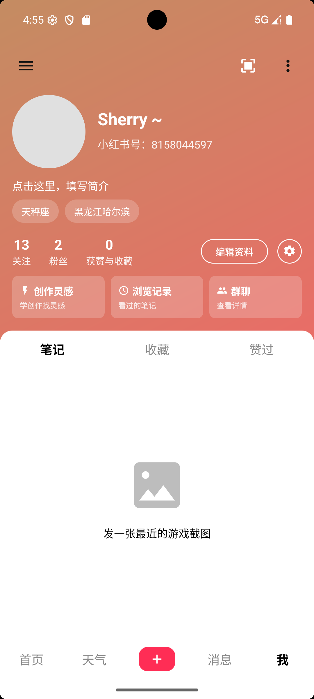
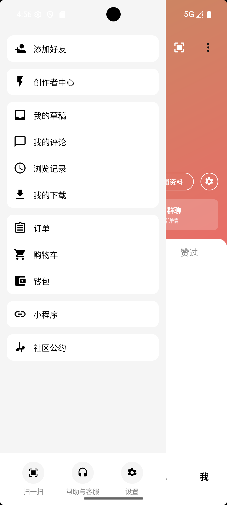

# Xhs Demo

一个用 Kotlin 与 Jetpack 组件快速搭建的“小红书”风格 Android Demo，包含登录、首页瀑布流、笔记详情、发布、个人主页、设置与天气查询等核心流转，适合用来演示多页面导航、基础数据存储与网络请求的整合。

## 主要功能
- 登录与会话：手机号+密码登录，内置默认账号，登录态与主题模式通过 `SessionManager` 写入 SharedPreferences。
- 首页瀑布流：`StaggeredGridLayoutManager` 双列布局，支持下拉刷新、自动触底加载更多、错误/空态处理，点击进入详情。
- 笔记详情：展示封面、标题、正文、作者信息及评论列表。
- 发布笔记：从相册选择图片（Activity Result API），填写标题/正文生成本地 Post，通过 `Intent` 回传并插入首页顶部。
- 个人主页：头像/昵称可修改（本地 Room 持久化），支持从相册换头像；底部导航与抽屉入口复刻主站交互。
- 设置与抽屉：常见入口的列表展示，登出/切账号会清理登录态并返回登录页。
- 天气页：内置北京/上海/广州/深圳四个 Tab，调用高德天气 API（Retrofit+Gson）展示温度、湿度、风力等信息，含加载中与错误重试状态。

## 环境与依赖
- Android Studio Ladybug | AGP 8.13.0 | Kotlin 2.0.21
- `compileSdk = 36`，`targetSdk = 36`，`minSdk = 24`
- 主要三方库：Room（本地存储）、Retrofit + Gson（网络）、Coil（图片）、Material/DrawerLayout/ViewPager2/SwipeRefreshLayout/RecyclerView 等
- JDK 11，Gradle 包装器已内置（`gradlew` / `gradlew.bat`）

## 快速开始
1) 打开项目：Android Studio 直接 `Open` 根目录（`XhsDemo`），等待 Gradle Sync 完成。  
2) 运行：连接设备或启动 API 24+ 模拟器，执行 **Run ‘app’** 或命令行：
```bash
./gradlew assembleDebug   # Windows 可用 .\gradlew.bat assembleDebug
```
3) 登录账号：默认手机号 `13800138000`，密码 `123456`。首次启动会自动插入该账号到 Room。登录成功后记住状态，下次启动直接进首页。
4) 天气接口：`app/src/main/java/com/bytedance/xhsdemo/ui/weather/WeatherFragment.kt` 中有演示用 `AMAP_KEY`，如需正式流量请替换为自己的高德 Key。

## 目录速览
```
app/
├─ build.gradle.kts                // 模块配置，启用 viewBinding、kapt、parcelize
└─ src/main/
   ├─ java/com/bytedance/xhsdemo/
   │  ├─ data/                     // 仓库层，包含 Room DAO/实体、会话管理、假数据源
   │  ├─ model/                    // Parcelable 数据模型（Post/Comment）
   │  ├─ ui/                       // 各页面与 Adapter、ViewModel
   │  ├─ utils/                    // Toast 工具
   │  └─ *.kt                      // Activity 入口（Main/Login/Profile/Publish/Settings/Detail）
   └─ res/                         // 布局、动画、主题与图片占位资源
```

## 关键流转说明
- 登录页 `LoginActivity` + `LoginViewModel`：StateFlow 管理输入/加载态，Room 校验账号，成功后跳转主界面并记住登录态。
- 主界面 `MainActivity`：`ViewPager2` 承载首页/天气/占位/个人四个 Tab，底部导航与抽屉联动。
- 首页 `HomeFragment`：`PostListViewModel` 通过内存假数据源 `FakePostRepository` 分页拉取，支持下拉刷新与触底自动加载；`PostAdapter` 负责瀑布流项与尾部状态（加载/失败/无更多）。
- 发布 `PublishActivity`：选图+文本生成本地 `Post`，通过 `ActivityResult` 回传给 `MainActivity` 并插入列表顶部。
- 详情 `PostDetailActivity`：使用 Coil 加载封面/头像，渲染评论列表或“暂无评论”占位。
- 个人页 `ProfilePageFragment` 与 `ProfileActivity`：依赖 `ProfileViewModel` 从 Room 读取/更新昵称、签名、头像；支持相册选头像、弹窗修改昵称。
- 设置 `SettingsActivity`：演示型列表，点击提示 Toast；登出/切换账号会清理登录态并返回登录页。
- 天气 `WeatherFragment`：Retrofit 调用高德天气基础接口，Tab 切换城市、显示温度/湿度/风向风力/上次更新时间，失败可点击提示重试。

## 数据与存储
- Room：库名 `xhs-demo.db`，表 `UserEntity`（账号）、`UserProfileEntity`（个人信息），初次创建时自动插入默认用户与头像昵称。
- 内存假数据：`FakePostRepository` 生成 Unsplash 图片+随机标题/评论的帖子，分页模拟网络延迟与偶发错误；发布的笔记会追加到内存列表开头。
- 会话：`SessionManager` 存储登录状态与主题模式（默认日间）。

## 注意事项与可拓展点
- 当前文案/数据均为演示用途，未接入真实后端；高德 Key 仅供测试，请替换为自己的 Key 并在生产环境做安全处理。
- Feed 图片依赖外网 Unsplash，如需离线演示可替换为本地资源或本地服务器。
- 可进一步接入真实接口、完善消息页、为设置/抽屉项补充实际跳转与深色模式切换。

## 演示

### 登录界面


### 首页样式


### 天气页面样式


### 个人中心页面样式


### 侧边栏样式


### 设置界面


