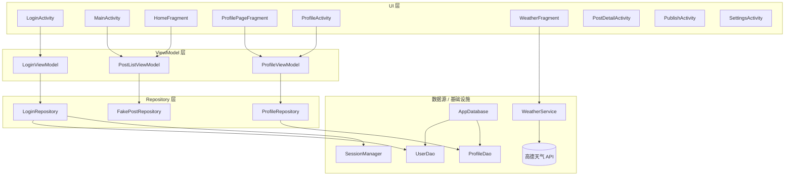
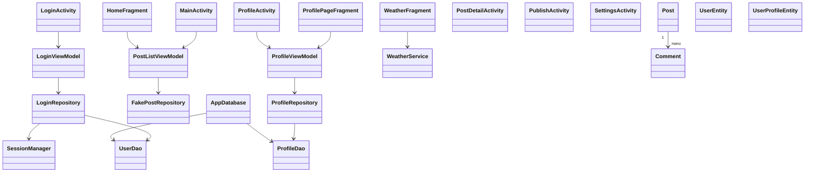

# Xhs Demo 技术设计文档（v1）

完成人：李萧
学校：哈尔滨工业大学
分组：2026 客户端工程训练营-Global Live-社交

[TOC]

## 1. 项目概览

### 1.1 背景与目标

Xhs Demo 是一个使用 Kotlin 与 Jetpack 组件实现的“小红书”风格 Android Demo，目标是：

- 提供从「登录 → 首页 → 详情 / 发布 → 个人 → 设置」的完整业务闭环示例。
- 演示瀑布流、分页加载、错误/空数据状态等常见列表场景。
- 演示 Room + SharedPreferences 搭建本地账号体系与会话管理。
- 演示 Retrofit + Gson 集成第三方天气 API。
- 演示图片加载、状态栏适配、Activity 转场等 UI 实战技巧。

### 1.2 功能范围

- 登录与会话：手机号+密码登录，默认内置账号；登录态持久化，冷启动自动跳过登录页。
- 首页瀑布流：双列瀑布流布局，下拉刷新、自动触底加载更多，支持加载中 / 错误 / 空数据状态。
- 笔记详情：展示封面图、标题、正文、作者信息、发布时间及评论列表。
- 发布笔记：从相册选图、输入标题与正文，生成本地 `Post` 并插入首页列表顶部。
- 个人主页：展示头像、昵称、签名；支持更换头像、修改昵称。
- 设置与抽屉菜单：左侧抽屉入口合集，设置页多组列表项，支持退出登录/切换账号。
- 天气查询：城市 Tab 切换（北京/上海/广州/深圳），调用高德天气 API 展示实时天气。

### 1.3 技术栈与主要依赖

- Kotlin + AndroidX（AppCompat、Activity、Fragment 等）
- MVVM + Repository + StateFlow/SharedFlow
- UI：RecyclerView、StaggeredGridLayoutManager、SwipeRefreshLayout、DrawerLayout、ViewPager2、Material、ViewBinding
- 数据与网络：Room、SharedPreferences、Retrofit、Gson、Coil
- 构建：AGP 8.13、Kotlin 2.0.21、Gradle Kotlin DSL、`libs.versions.toml`

### 1.4 运行环境

- `compileSdk = 36` / `targetSdk = 36` / `minSdk = 24`
- JDK 11
- IDE：Android Studio Ladybug+
- 主要命令：
  - 构建 Debug：`./gradlew assembleDebug`
  - 单元测试：`./gradlew test`
  - 仪表测试：`./gradlew connectedAndroidTest`

---

## 2. 整体架构设计

### 2.1 架构模式

整体采用轻量 **MVVM + Repository** 分层：

- UI 层：Activity/Fragment/Adapter 负责界面展示与用户交互，不直接访问数据库或网络。
- ViewModel 层：维护 UI 状态（StateFlow）与一次性事件（SharedFlow），编排业务逻辑。
- 数据层：Repository 封装 Room、SharedPreferences、内存假数据源、Retrofit 网络服务。

依赖方向：`UI → ViewModel → Repository → 数据源`，保证单向依赖，便于维护与扩展。

### 2.2 包结构与职责

根包：`com.bytedance.xhsdemo`

- `data/`
  - `SessionManager`：会话与主题模式管理（SharedPreferences）。
  - `LoginRepository`：登录与默认用户初始化。
  - `ProfileRepository`：个人资料读写。
  - `FakePostRepository`：Feed 假数据源（内存）。
  - `local/`：Room 数据层（`AppDatabase`、`UserDao`、`ProfileDao`、实体类）。
- `model/`
  - `Post`、`Comment` 等业务模型（`@Parcelize`，用于页面间传递）。
- `ui/`
  - `home/`：首页瀑布流（`HomeFragment`）。
  - `login/`：登录 ViewModel 等。
  - `profile/`：个人页 Fragment + ViewModel。
  - `weather/`：天气 Fragment、Service、数据模型。
  - `placeholder/`：占位 Fragment。
  - 通用 UI：`PostAdapter`、`PostListViewModel`、`WaterfallSpacingDecoration` 等。
- 根级 Activity：
  - `MainActivity`、`LoginActivity`、`PostDetailActivity`、`PublishActivity`、`ProfileActivity`、`SettingsActivity`。
- `utils/`
  - `ToastUtils`：统一的 Toast 工具。

### 2.3 Activity / Fragment 关系

- 冷启动：进入 `LoginActivity`，若检测已登录则直接跳转 `MainActivity`。
- `MainActivity`：
  - 使用 `ViewPager2` 承载 4 个 Fragment：
    - `HomeFragment`：首页。
    - `WeatherFragment`：天气。
    - `PlaceholderFragment`：消息占位。
    - `ProfilePageFragment`：个人页。
  - 自定义底部导航与 ViewPager 同步。
  - 左侧 `DrawerLayout` 作为抽屉菜单。
- 其他页面：
  - `PostDetailActivity`：从首页点击某条笔记进入。
  - `PublishActivity`：从首页发布按钮或个人页 FAB 进入。
  - `ProfileActivity`：个人页的独立 Activity 版本。
  - `SettingsActivity`：从抽屉或个人页进入。

### 2.4 数据流向

- 登录：`LoginActivity → LoginViewModel → LoginRepository → UserDao + SessionManager`
- 首页 Feed：`HomeFragment → PostListViewModel → FakePostRepository`
- 个人资料：`ProfilePageFragment/ProfileActivity → ProfileViewModel → ProfileRepository → ProfileDao`
- 天气：`WeatherFragment → WeatherService (Retrofit) → 高德天气 API`

### 2.5 代码架构图（Mermaid）

---

## 3. 模块设计概述

### 3.1 UI 层

- `LoginActivity`：登录表单、协议勾选、错误提示，监听 `LoginViewModel` 状态并导航到主界面。
- `MainActivity`：主容器，负责 ViewPager2 + 底部导航 + 抽屉菜单 + 会话检查。
- `HomeFragment`：瀑布流列表，下拉刷新，底部自动加载更多，订阅 `PostListViewModel`。
- `PostDetailActivity`：展示单条 Post 的详情与评论。
- `PublishActivity`：图片选择 + 标题/内容输入，生成 Post 并回传给 MainActivity。
- `ProfilePageFragment` / `ProfileActivity`：展示/编辑个人资料，订阅 `ProfileViewModel`。
- `SettingsActivity`：展示设置项列表，处理退出登录/切换账号。
- `WeatherFragment`：天气城市 Tab 切换、请求天气并展示结果。
- `PlaceholderFragment`：占位页面。

### 3.2 数据层

- `LoginRepository`：
  - 使用 `UserDao`、`SessionManager`。
  - `ensureDefaultUser()`：首次运行时插入默认账号。
  - `login(phone, password)`：校验账号密码并写入登录态。
- `ProfileRepository`：
  - 使用 `ProfileDao`。
  - `loadProfile()`：懒加载默认资料并缓存。
  - `updateAvatar(uri)` / `updateName(name)`：更新资料。
- `FakePostRepository`：
  - 内存维护 `List<Post>`。
  - `fetchPosts(page, pageSize, callback)`：模拟分页和网络延迟/失败。
  - `addPost(post)`：在列表头部插入新 Post。
  - `refreshData()`：生成新的假数据集。

### 3.3 存储与会话

- Room：
  - `AppDatabase`：统一入口，`userDao()` / `profileDao()`。
  - `UserEntity`：手机号+密码（演示环境明文）。
  - `UserProfileEntity`：昵称、签名、头像地址。
  - 使用 `fallbackToDestructiveMigration()` + `addCallback` 预置默认账号与资料。
- SharedPreferences：
  - `SessionManager`：
    - `logged_in`：是否已登录。
    - `theme_mode`：当前夜间模式。

### 3.4 工具模块

- `ToastUtils`：
  - 提供统一 `show(context, text)` 与 `cancel()`。
  - 多数 Activity 在 `dispatchTouchEvent` 中调用 `ToastUtils.cancel()`，避免 Toast 悬浮过久。

---

## 4. 关键业务流程设计

### 4.1 登录与会话流程

1. 冷启动：`LoginActivity` 读取 `SessionManager.isLoggedIn()`。
   - 若为 true：直接跳转 `MainActivity` 并 `finish()`。
2. 默认账号初始化：`LoginViewModel` 初始化时调用 `LoginRepository.ensureDefaultUser()`。
3. 输入与校验：
   - 文本变化：调用 `onPhoneChanged` / `onPasswordChanged` 更新 `LoginUiState`。
   - 协议勾选：`onAgreementChecked` 保存状态。
   - 点击登录：`submitLogin()` 做前端校验（非空、协议已勾选）。
4. 登录请求：
   - `LoginRepository.login(phone, password)` 调用 Room 查询用户并比对密码。
   - 成功：`SessionManager.setLoggedIn(true)`，状态中设置 `loginSuccess = true` 并发送“登录成功”事件。
   - 失败：更新 `error` 字段并发送错误文案事件。
5. 跳转：Activity 监听 `LoginUiState`，检测到 `loginSuccess` 后跳转至 `MainActivity`。

### 4.2 首页 Feed 流程

1. 初始化：
   - `MainActivity` 创建 `PostListViewModel`。
   - `HomeFragment` 通过 `activityViewModels()` 共享 ViewModel。
2. 首次加载：
   - 若 `state.items` 为空，则在 `onViewCreated` 中调用 `viewModel.refresh()`。
3. 下拉刷新：
   - SwipeRefreshLayout 调用 `refresh()`：
     - 重置分页状态 （`page=1`, `hasMore=true`）。
     - 调用 `FakePostRepository.refreshData()`。
     - 加载第一页数据。
4. 加载更多：
   - 监听 RecyclerView 滚动位置，当最后可见 item 接近末尾时调用 `loadMore()`。
   - `loadMore()` 根据当前 `page` 调用 `fetchPosts`。
5. 数据回调：
   - 成功：刷新模式替换列表，加载更多模式在尾部追加；根据返回数量设置 `hasMore` 与 `footerState`。
   - 失败：刷新失败显示错误页；加载更多失败仅切 Footer 为 ERROR 并触发 Toast。
6. UI 渲染：
   - HomeFragment 收集 `PostListState`，控制刷新的 loading、空态、错误页、Footer 状态。

### 4.3 发布笔记流程

1. 入口：用户在 `MainActivity` 点击中间发布按钮。
2. 打开发布页：
   - 使用 `ActivityResultContracts.StartActivityForResult` 启动 `PublishActivity`。
3. 发布页交互：
   - 点击“选择图片”使用 `GetContent` 打开系统相册，预览选中图片。
   - 用户输入标题与正文。
4. 发布：
   - 若标题、内容、图片全为空，则 Toast 提示需要填写内容。
   - 否则组装 `Post`：
     - 默认标题/内容使用友好的占位文案。
     - 图片使用选中 Uri 或默认网络图。
   - 使用 `setResult(RESULT_OK, Intent().putExtra(EXTRA_NEW_POST, post))` 回传。
5. 回主界面：
   - `publishLauncher` 回调中读取 Post，对 `PostListViewModel.addPost(post)`，插入列表顶部并切到首页 Tab。

### 4.4 详情浏览流程

1. 用户点击首页某条卡片。
2. `PostAdapter` 调用传入的 `onItemClick(post)`。
3. `HomeFragment` 启动 `PostDetailActivity` 并通过 Intent 传入 `Post`。
4. 详情页读取 `EXTRA_POST`：
   - 若为空，立即 `finish()`，避免空界面。
   - 填充封面、标题、正文、作者、时间。
   - 渲染评论列表或“暂无评论”占位。

### 4.5 个人主页流程

1. 登录校验：进入个人页前调用 `SessionManager.isLoggedIn()`，未登录跳转登录页。
2. 加载资料：`ProfileViewModel.load()` 调用 `ProfileRepository.loadProfile()`。
   - 数据不存在时插入默认昵称/签名/头像。
3. 修改头像：
   - 点击头像启动 `GetContent` 选择图片。
   - 回调中调用 `updateAvatar(uri)`，写入 Room 并重新加载。
4. 修改昵称：
   - 点击昵称弹出 `AlertDialog`，确认后调用 `updateName(name)`。

### 4.6 天气查询流程

1. 初始化 Retrofit 与 `WeatherService`。
2. Tab 点击切换 `currentCity`，更新 Tab 样式并触发 `loadWeather(city)`。
3. 在协程中调用 `service.getWeather(adcode, AMAP_KEY)` 获取天气。
4. 若成功且数据有效，调用 `updateUI(live)` 更新城市、温度、天气、风向风力、湿度、更新时间。
5. 异常或失败时显示错误文案组件，允许用户点击重试。

### 4.7 设置与登出流程

1. 设置页通过 `ItemSettingsRowBinding` 渲染多组条目，点击仅展示 Toast。
2. “退出登录”“切换账号”触发 `logoutAndBack()`：
   - 更新 `SessionManager.setLoggedIn(false)`。
   - 使用标志位清空任务栈并跳转 `LoginActivity`。

---

## 5. 数据模型与存储设计

### 5.1 Post / Comment 模型

- `Comment`：
  - `id: String`
  - `userName: String`
  - `userAvatar: String`
  - `content: String`
- `Post`：
  - `id: String`
  - `title: String`
  - `content: String`
  - `imageUrl: String`
  - `authorName: String`
  - `authorAvatar: String`
  - `publishTime: String`
  - `likes: Int`
  - `comments: List<Comment>`

两者均使用 `@Parcelize` 实现 Parcelable，方便 Activity/Fragment 间传递。

### 5.2 用户与资料实体

- `UserEntity`：
  - `phone: String`
  - `password: String`（演示环境明文存储）
- `UserProfileEntity`：
  - `displayName: String`
  - `signature: String`
  - `avatarUrl: String`

### 5.3 Room 数据库设计

- `AppDatabase`：
  - `@Database(entities = [UserEntity, UserProfileEntity], version = 2, exportSchema = false)`
  - 提供 `userDao()` / `profileDao()`。
  - `fallbackToDestructiveMigration()` 简化迁移。
  - 在 `onCreate` 回调中插入默认用户与默认个人资料。

### 5.4 会话存储

- `SessionManager` 基于 `SharedPreferences("login_prefs")`：
  - `isLoggedIn()` / `setLoggedIn()` 管理登录态。
  - `getThemeMode()` / `setThemeMode()` 管理主题模式。

### 5.5 假数据源

- `FakePostRepository`：
  - 在内存中维护帖子列表，使用随机标题/封面/评论生成假数据。
  - `fetchPosts` 模拟分页与失败场景；
  - `addPost` 将用户发布的本地 Post 插入首位；
  - `refreshData` 重置数据集。

### 5.6 核心类图（Mermaid）

---

## 6. 状态管理与异步流程

### 6.1 ViewModel 状态模式

各 ViewModel 统一采用：

- `MutableStateFlow<State>` + `StateFlow<State>` 保存界面状态。
- `MutableSharedFlow<Event>` + `SharedFlow<Event>` 推送一次性事件（Toast 等）。
- 在 `viewModelScope.launch` 协程中执行业务逻辑。

### 6.2 异步与线程

- Room 挂起函数由 Room 管理线程。
- Retrofit 请求在天气模块中通过 `withContext(Dispatchers.IO)` 运行。
- Fake 数据回调通过 `viewModelScope.launch` 切回主协程更新 UI 状态。

### 6.3 列表状态机

`PostListState` 包含：

- `items`：当前列表数据。
- `isRefreshing` / `isInitialLoading`。
- `footerState`：HIDDEN/LOADING/ERROR/NO_MORE。
- `showError` / `showEmpty`。
- `hasMore` / `page`：分页信息。

刷新与加载更多共用该状态机，HomeFragment 只需订阅一个 StateFlow 即可驱动 UI。

---

## 7. 网络与第三方服务设计

### 7.1 Retrofit 与 Service

- `WeatherService`：
  - `@GET("v3/weather/weatherInfo")`
  - 参数：`city`（adcode）、`key`（高德 Key）、`extensions="base"`。
- Retrofit 在 `WeatherFragment` 中初始化，使用 `GsonConverterFactory`。

### 7.2 模型

- `WeatherResponse`：`status`、`info`、`lives` 等。
- `WeatherLive`：`city`、`weather`、`temperature`、`winddirection`、`windpower`、`humidity`、`reporttime` 等字段。

### 7.3 错误处理与重试

- 请求前：展示进度条，隐藏卡片和错误文案。
- 请求成功且数据有效：展示天气卡片。
- 请求失败或数据无效：展示错误提示，允许点击重试。

### 7.4 API Key 管理建议

Demo 中 Key 直接写在代码里，正式环境建议放入构建配置或远程配置，并对调用做限流和校验。

---

## 8. UI / UX 设计要点

### 8.1 导航

- `MainActivity` 负责底部 Tab + 抽屉菜单。
- 使用 ViewPager2 承载四大功能页，避免频繁重建 Fragment。

### 8.2 列表与布局

- 首页使用 `StaggeredGridLayoutManager(2, VERTICAL)` 实现瀑布流。
- 通过 `WaterfallSpacingDecoration` 控制间距，关闭默认 ItemAnimator 减少闪烁。

### 8.3 图片与占位

- 使用 Coil 加载网络图和本地 Uri。
- 头像应用圆形裁剪，统一 placeholder/error 占位图。

### 8.4 动画与系统栏

- Activity 打开/关闭使用自定义转场（左右滑动）。
- 使用 WindowInsets API 处理沉浸式状态栏和底部导航栏，保留内容可见性。

---

## 9. 错误处理与用户提示

### 9.1 Toast 统一管理

- 通过 `ToastUtils.show` 与 `ToastUtils.cancel` 统一调用。
- 多个 Activity 在触摸事件开始时取消当前 Toast，避免堆积与遮挡。

### 9.2 列表错误与空态

- 刷新失败显示整页错误视图，可点击重试。
- 加载更多失败只在 Footer 显示错误按钮，并提示 Toast。
- 无数据时显示空态占位。

### 9.3 登录与网络错误

- 登录前端校验必填项与协议勾选。
- 错误信息通过 `LoginUiState.error` + Toast 同步反馈。
- 天气模块网络错误通过错误文案 + 点击重试处理。

---

## 附录：Git 提交记录概览

> 截至当前，共 22 次提交，时间范围为 2025-12-01 ～ 2025-12-02。  

| 提交哈希 | 日期       | 作者       | 摘要（中文）                                   |
|----------|------------|------------|-----------------------------------------------|
| a0756bc  | 2025-12-01 | 2364701242 | 初始提交：搭建 Android Demo 工程骨架           |
| bbd10c7  | 2025-12-01 | 2364701242 | 新增登录、个人主页和设置基础功能               |
| bcbe046  | 2025-12-01 | 2364701242 | 抽屉菜单重构到 MainActivity，并新增菜单布局     |
| 2023abd  | 2025-12-01 | 2364701242 | 个人页新增扫码按钮并更新相关 UI 布局           |
| 79e2d6f  | 2025-12-01 | 2364701242 | 重设计首页 UI，完善 WindowInsets 适配           |
| adc2329  | 2025-12-01 | 2364701242 | 个人页支持头像与昵称编辑                       |
| dea717b  | 2025-12-01 | 2364701242 | 重构个人资料加载逻辑并优化 UI 展示             |
| a72c3a9  | 2025-12-01 | 2364701242 | 重构底部导航并打通发布笔记流程                 |
| b5d5ef1  | 2025-12-01 | 2364701242 | 重做抽屉菜单 UI 并补充图标资源                 |
| b2b45a9  | 2025-12-01 | 2364701242 | 重做笔记详情页 UI 并添加新图标资源             |
| 0cdd059  | 2025-12-01 | 2364701242 | 将 Toast 使用统一封装到 ToastUtils             |
| c2d3fb7  | 2025-12-01 | 2364701242 | 重做设置页 UI 并补充设置图标                   |
| 1ec14fe  | 2025-12-02 | 2364701242 | 新增天气功能，支持城市切换                     |
| 9fa6c56  | 2025-12-02 | 2364701242 | 新增社交图标资源并修复相关按钮属性             |
| e67bc36  | 2025-12-02 | 2364701242 | 重构登录界面 UI，补充颜色与图标资源            |
| bd2f101  | 2025-12-02 | 2364701242 | 优化首页列表刷新与加载更多行为                 |
| 30193ae  | 2025-12-02 | 2364701242 | 新增项目 README，梳理特性概览                  |
| c01ffde  | 2025-12-02 | 2364701242 | 更新 README 图片链接并添加示例截图             |
| 8f9058e  | 2025-12-02 | 2364701242 | 完善 README 中的 UI 演示说明                   |
| d88ae76  | 2025-12-02 | 2364701242 | 更新 README 项目描述文案                       |
| 9a4ec3b  | 2025-12-02 | 2364701242 | 在 PublishActivity 中处理状态栏 Insets         |
| 7491c46  | 2025-12-02 | 2364701242 | 为图片选择流程添加可持久化 URI 权限            |
| 1f81747  | 2025-12-02 | 2364701242 | 新增 Xhs Demo 技术设计文档                     |

### 提交详情说明

- **a0756bc – 初始提交：搭建 Android Demo 工程骨架**  
  创建基础 Gradle 工程与 `:app` 模块，配置 Kotlin、AGP、依赖管理和最小运行环境，为后续功能开发提供工程基础。

- **bbd10c7 – 新增登录、个人主页和设置基础功能**  
  实现登录流程（含 ViewModel 与 Room 默认用户）、基础个人资料展示页面以及设置页面骨架，打通最核心的“登录 → 我的 → 设置”导航链路。

- **bcbe046 – 抽屉菜单重构到 MainActivity，并新增菜单布局**  
  将抽屉导航集中到 `MainActivity` 管理，抽离并重用布局 `view_drawer_menu`，统一 Drawer 的开关与交互逻辑，便于多个页面复用。

- **2023abd – 个人页新增扫码按钮并更新相关 UI 布局**  
  在个人页添加扫码入口按钮，调整头像区域与操作按钮布局，使交互更贴近真实产品样式，同时优化点击反馈。

- **79e2d6f – 重设计首页 UI，完善 WindowInsets 适配**  
  对首页瀑布流区域进行重新排版，优化卡片样式与间距，并通过 WindowInsets 动态处理状态栏高度，提升沉浸式体验。

- **adc2329 – 个人页支持头像与昵称编辑**  
  增加从相册选择头像、弹窗修改昵称能力，对应数据落库到 `UserProfileEntity`，实现简单的“编辑资料”功能闭环。

- **dea717b – 重构个人资料加载逻辑并优化 UI 展示**  
  将 Profile 加载逻辑集中到 `ProfileRepository` 和 `ProfileViewModel`，统一处理默认数据、刷新与错误，简化 UI 层代码。

- **a72c3a9 – 重构底部导航并打通发布笔记流程**  
  调整底部导航结构和样式，引入中央发布按钮，打通从首页到底发布页再回传新 Post 并插入列表顶部的完整流程。

- **b5d5ef1 – 重做抽屉菜单 UI 并补充图标资源**  
  更新 Drawer 的分组样式与排版，引入多组图标资源，使菜单更贴近真实 App 的视觉与信息层级。

- **b2b45a9 – 重做笔记详情页 UI 并添加新图标资源**  
  调整详情页布局结构，增强封面图展示效果，增加评论区头像与图标，提升整体观感与可读性。

- **0cdd059 – 将 Toast 使用统一封装到 ToastUtils**  
  新增 `ToastUtils` 工具类，替换分散的 `Toast.makeText` 调用，实现统一的 Toast 管理与取消逻辑，避免多 Toast 堆叠。

- **c2d3fb7 – 重做设置页 UI 并补充设置图标**  
  对设置页进行模块化分组设计，引入多种设置项图标，统一行高和点击区域，提升可用性与视觉一致性。

- **1ec14fe – 新增天气功能，支持城市切换**  
  新增 `WeatherFragment`、`WeatherService`、天气数据模型，集成高德天气 API，实现城市 Tab 切换展示实况天气功能。

- **9fa6c56 – 新增社交图标资源并修复相关按钮属性**  
  添加微信/QQ/Apple 等社交登录图标资源，修正布局与点击区域属性，为登录页提供更真实的第三方登录入口样式。

- **e67bc36 – 重构登录界面 UI，补充颜色与图标资源**  
  调整登录页布局层级、输入框与按钮样式，引入新的颜色与图标资源，使登录流程更美观、信息层级更清晰。

- **bd2f101 – 优化首页列表刷新与加载更多行为**  
  微调 `PostListViewModel` 和 `PostAdapter` 的状态机逻辑，改善刷新/加载更多时 Footer 展示、错误处理与空态展示体验。

- **30193ae – 新增项目 README，梳理特性概览**  
  添加初版 README，说明项目背景、功能点、技术栈和快速启动方式，方便读者快速理解与上手。

- **c01ffde – 更新 README 图片链接并添加示例截图**  
  将 README 中的图片替换为更稳定的外链，新增部分 Demo 截图，帮助读者直观了解 UI 效果。

- **8f9058e – 完善 README 中的 UI 演示说明**  
  调整 README 文案结构，补充 UI 相关说明，对截图和功能点做更清晰的注释，提高可读性。

- **d88ae76 – 更新 README 项目描述文案**  
  优化 README 顶部描述和简介，让项目定位、用途和适用场景更明确。

- **9a4ec3b – 在 PublishActivity 中处理状态栏 Insets**  
  为发布页面增加状态栏高度适配逻辑，在沉浸式场景下确保标题栏与内容位置正确。

- **7491c46 – 为图片选择流程添加可持久化 URI 权限**  
  在图片选择后申请/持久化 Uri 访问权限，避免应用重启或长时间运行后无法再次访问已选图片的问题。

- **1f81747 – 新增 Xhs Demo 技术设计文档**  
  添加当前这份技术设计文档草稿，梳理项目架构、模块设计、关键流程、数据模型以及提交历史，方便维护与交接。

