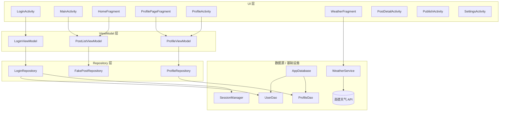
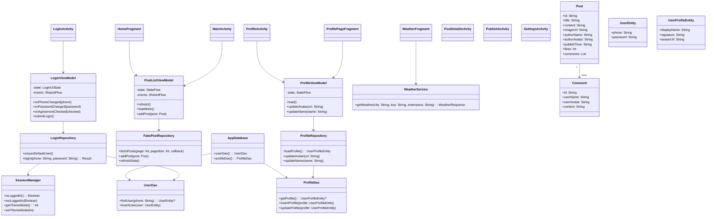

# Xhs Demo 技术设计文档

[TOC]

## 1. 项目概览

### 1.1 背景与目标

Xhs Demo 是一个使用 Kotlin 与 Jetpack 组件实现的“小红书”风格 Android Demo，目标是：

- 提供从「登录 → 首页 → 详情 / 发布 → 个人 → 设置」的完整业务闭环示例。
- 演示瀑布流、分页加载、错误/空数据状态等常见列表场景。
- 演示 Room + SharedPreferences 搭建本地账号体系与会话管理。
- 演示 Retrofit + Gson 集成第三方天气 API。
- 演示图片加载、状态栏适配、Activity 转场等。

### 1.2 功能范围

- 登录与会话
  - 手机号 + 密码登录，内置默认账号（无需注册）。
  - 登录态持久化，冷启动时自动跳过登录页。
- 首页瀑布流
  - 双列瀑布流布局。
  - 下拉刷新、自动触底加载更多。
  - 加载中 / 错误 / 空数据状态展示。
  - 点击卡片进入笔记详情页。
- 笔记详情
  - 展示封面图、标题、正文、作者信息、发布时间。
  - 评论列表展示，无评论时显示占位文案。
- 发布笔记
  - 系统相册选择图片。
  - 输入标题与正文，生成本地 `Post`。
  - 发布成功后插入首页列表顶部。
- 个人主页
  - 显示头像、昵称、签名等基本信息。
  - 修改昵称（弹窗编辑），更换头像（相册选择）。
  - Tab（笔记 / 收藏 / 赞过）与快捷入口点击反馈。
- 设置与抽屉菜单
  - 左侧抽屉包含帮助、订单、设置等入口。
  - 设置页分组列表项点击提示 Toast。
  - 退出登录 / 切换账号。
- 天气查询
  - 城市 Tab（北京 / 上海 / 广州 / 深圳）切换。
  - 调用高德天气 API 获取实况天气。
  - 显示温度、天气现象、湿度、风向风力、更新时间。
  - 加载中、错误提示与重试。

### 1.3 技术栈与主要依赖

- 语言与基础
  - Kotlin
  - AndroidX：AppCompat、Activity、Fragment、RecyclerView 等
- 架构与状态
  - ViewModel（`androidx.lifecycle:viewmodel-ktx`）
  - Kotlin Coroutines（`viewModelScope`）
  - StateFlow / SharedFlow 管理 UI 状态与一次性事件
- UI 组件
  - RecyclerView + StaggeredGridLayoutManager
  - SwipeRefreshLayout
  - DrawerLayout
  - ViewPager2（主页面 Tab 容器）
  - Material Components
  - ViewBinding（全局启用）
- 数据与网络
  - Room：本地账号、个人资料持久化
  - SharedPreferences：会话与主题模式
  - Retrofit + Gson + converter-gson：天气接口
  - Coil：图片加载与圆形头像
- 构建
  - Gradle Kotlin DSL
  - 版本管理：`gradle/libs.versions.toml`

### 1.4 运行环境

- `compileSdk = 36`
- `targetSdk = 36`
- `minSdk = 24`
- JDK 11
- IDE：Android Studio Ladybug 及以上
- 构建命令：
  - Debug：`./gradlew assembleDebug`
  - 测试：`./gradlew test`、`./gradlew connectedAndroidTest`

---

## 2. 整体架构设计

### 2.1 架构模式

整体采用轻量 MVVM + Repository 分层架构：

- UI 层（Activity / Fragment / Adapter）
  - 负责视图展示与用户交互。
  - 使用 ViewBinding 访问视图。
  - 监听 ViewModel 暴露的 StateFlow / SharedFlow 更新界面。
- ViewModel 层
  - 持有 UI 状态（State）和一次性事件（Event）。
  - 在 `viewModelScope` 中编排业务流程。
  - 调用 Repository 获取/更新数据。
- 数据层（Repository + 数据源）
  - Room 本地数据库（账号与个人资料）。
  - 内存假数据源（Feed 列表）。
  - SharedPreferences（会话与主题模式）。
  - Retrofit 网络服务（天气）。

依赖方向：UI → ViewModel → Repository → 数据源，保证单向依赖、职责清晰。

### 2.2 包结构与职责

根包：`com.bytedance.xhsdemo`

- `data/`
  - 会话与配置：`SessionManager`
  - 仓库：
    - `LoginRepository`：登录逻辑
    - `ProfileRepository`：个人资料逻辑
    - `FakePostRepository`：Feed 假数据源
  - `local/`：Room 相关
    - `AppDatabase`、`UserDao`、`ProfileDao`
    - `UserEntity`、`UserProfileEntity`
- `model/`
  - `Post`、`Comment`（`@Parcelize`，用于页面间传递）
- `ui/`
  - `home/`：首页瀑布流（`HomeFragment`）
  - `login/`：登录页 ViewModel 等
  - `profile/`：个人页 Fragment + ViewModel
  - `placeholder/`：占位页面
  - `weather/`：天气 Fragment / Service / 模型
  - 通用 UI：`PostAdapter`、`PostListViewModel`、`WaterfallSpacingDecoration`
- 根 Activity：
  - `MainActivity`、`LoginActivity`、`PostDetailActivity`
  - `PublishActivity`、`ProfileActivity`、`SettingsActivity`
- `utils/`
  - `ToastUtils`：统一 Toast 管理

### 2.3 Activity / Fragment 关系

- 启动与登录：
  - 冷启动进入 `LoginActivity`。
  - 若已登录（`SessionManager.isLoggedIn()`），则直接跳转 `MainActivity`。
- `MainActivity`：
  - 使用 `ViewPager2` 承载 4 个 Fragment：
    - `HomeFragment`：首页
    - `WeatherFragment`：天气
    - `PlaceholderFragment`：消息占位页
    - `ProfilePageFragment`：个人页
  - 自定义底部导航与 ViewPager 双向联动。
  - 左侧 `DrawerLayout` 提供抽屉菜单。
- 其他页面：
  - `PostDetailActivity`：从首页点击卡片进入。
  - `PublishActivity`：从主界面中间发布按钮或个人页 FAB 进入。
  - `ProfileActivity`：个人页独立 Activity 版本。
  - `SettingsActivity`：从抽屉或个人页进入。

### 2.4 数据流向

- 登录：
  - `LoginActivity` → `LoginViewModel` → `LoginRepository` → `UserDao` + `SessionManager`
- 首页 Feed：
  - `HomeFragment` → `PostListViewModel` → `FakePostRepository`
- 个人资料：
  - `ProfilePageFragment` / `ProfileActivity`
    → `ProfileViewModel` → `ProfileRepository` → `ProfileDao`
- 天气：
  - `WeatherFragment` → `WeatherService`（Retrofit）→ 高德天气 API

UI 不直接操作数据库或网络，所有数据访问由 Repository 或 Service 抽象。

### 2.5 代码架构图（Mermaid）

---

## 3. 模块设计概述

### 3.1 UI 层

**Activity**

- `LoginActivity`
  - 管理登录表单与交互。
  - 订阅 `LoginViewModel` 状态更新按钮可用性与错误文案。
  - 登录成功后跳转 `MainActivity`，并设置登录态。
- `MainActivity`
  - 主容器：ViewPager2 + 自定义底部导航 + DrawerLayout。
  - 负责登录态检查与主题模式初始化。
  - 使用 `PostListViewModel` 共享首页列表状态。
- `PostDetailActivity`
  - 接收 `Post`，展示详情与评论。
  - 自定义返回转场动画。
- `PublishActivity`
  - 负责图片选择与文案输入，组装 `Post` 并通过 Activity Result 回传。
- `ProfileActivity` / `SettingsActivity`
  - 分别展示个人主页（Activity 版本）与设置页菜单。

**Fragment**

- `HomeFragment`
  - 瀑布流列表 + 下拉刷新 + 自动加载更多。
  - 订阅 `PostListViewModel` 的 StateFlow / SharedFlow。
- `ProfilePageFragment`
  - Fragment 版本个人页，与 `MainActivity` 共用底部导航和抽屉。
  - 支持头像选择与昵称修改。
- `WeatherFragment`
  - 城市 Tab + 网络请求 + 加载中/错误状态。
- `PlaceholderFragment`
  - 文案占位，方便后续实现消息页。

**Adapter / 装饰**

- `PostAdapter`
  - 负责 Post Item + Footer（加载中/错误/无更多）多类型布局。
- `WaterfallSpacingDecoration`
  - 统一控制瀑布流间距。

### 3.2 数据层

- `FakePostRepository`
  - 内存中的 Post 列表。
  - 生成随机 Post / Comment 数据。
  - 支持刷新、分页加载、添加新 Post。
  - 使用 Handler 模拟网络延迟与错误。
- `LoginRepository`
  - 登录逻辑与默认账号初始化。
  - 使用 `UserDao` 查询账号，校验密码，设置登录态。
- `ProfileRepository`
  - 加载和更新个人资料（昵称、签名、头像）。
  - 首次加载时自动插入默认资料。

### 3.3 存储与会话

- Room
  - `AppDatabase`：数据库入口，提供 `userDao()` / `profileDao()`。
  - `UserEntity`：账号密码（演示用途）。
  - `UserProfileEntity`：个人资料。
- SharedPreferences（`SessionManager`）
  - `isLoggedIn()` / `setLoggedIn()`：登录态。
  - `getThemeMode()` / `setThemeMode()`：深/浅色模式。

### 3.4 工具与基础设施

- `ToastUtils`
  - 统一 Toast 展示与取消。
  - 多个 Activity 在 `dispatchTouchEvent` 中调用 `ToastUtils.cancel()`，防止 Toast 长时间停留。

---

## 4. 关键业务流程设计

### 4.1 登录与会话流程

相关类：`LoginActivity`、`LoginViewModel`、`LoginRepository`、`AppDatabase`、`SessionManager`。

流程：

1. 冷启动：
   - `LoginActivity` 读取 `SessionManager.isLoggedIn()`。
   - 已登录则直接跳转 `MainActivity` 并 `finish()`。
2. 默认用户初始化：
   - `LoginViewModel` 初始化时调用 `LoginRepository.ensureDefaultUser()`。
   - 若默认账号不存在则写入 Room。
3. 输入与校验：
   - 输入框变化通过 `onPhoneChanged` / `onPasswordChanged` 更新 `LoginUiState`。
   - 协议勾选通过 `onAgreementChecked` 更新状态。
   - 点击登录触发 `submitLogin()`：
     - 前端校验：手机号/密码非空、协议已勾选。
4. 登录请求：
   - ViewModel 使用 `viewModelScope.launch` 调用 `LoginRepository.login`。
   - 成功：
     - 设置 `SessionManager.setLoggedIn(true)`。
     - 更新 `LoginUiState.loginSuccess = true`，并发送“登录成功” Toast 事件。
   - 失败：
     - 更新 `LoginUiState.error`，发送错误文案 Toast。
5. 导航：
   - Activity 订阅状态，检测到 `loginSuccess == true` 后跳转 `MainActivity`。

### 4.2 首页 Feed 流程

相关类：`MainActivity`、`HomeFragment`、`PostListViewModel`、`PostAdapter`、`FakePostRepository`。

流程：

1. ViewModel 初始化：
   - `MainActivity` 通过 `by viewModels()` 创建 `PostListViewModel`。
   - `HomeFragment` 通过 `activityViewModels()` 共享状态。
2. 首次加载：
   - 若进入首页时 `state.items` 为空，则自动调用 `viewModel.refresh()`。
3. 下拉刷新：
   - SwipeRefreshLayout 触发 `refresh()`：
     - 重置分页参数。
     - 调用 `FakePostRepository.refreshData()`。
     - 加载第一页数据。
4. 加载更多：
   - 监听 RecyclerView 滚动，当滑动到最后一项且允许加载更多时调用 `loadMore()`。
   - `loadMore()` 根据当前 `state.page` 发起下一页请求。
5. 数据返回：
   - `FakePostRepository.fetchPosts` 回调中：
     - 成功：合并数据，更新分页、`hasMore`、`footerState`。
     - 失败：
       - 刷新失败：显示错误页（`showError = true`）。
       - 加载更多失败：Footer 进入错误状态，并发送 Toast。
6. UI 更新：
   - `HomeFragment` 订阅 StateFlow，根据状态控制刷新动画、错误页、空态、Footer 文案。

### 4.3 发布笔记流程

相关类：`MainActivity`、`PublishActivity`、`Post`、`PostListViewModel`。

流程：

1. 打开发布页：
   - `MainActivity` 中间按钮点击 → `openPublish()`。
   - 使用 `ActivityResultContracts.StartActivityForResult` 启动 `PublishActivity`。
2. 发布页交互：
   - 点击“选择图片” → `ActivityResultContracts.GetContent()` 打开相册。
   - 输入标题与正文。
3. 点击“发布”：
   - 若标题、内容、图片均为空则提示“请先填写内容”。
   - 否则组装 `Post`：
     - 若缺少标题/正文则填入默认文案。
     - 图片使用选择的 Uri 或默认图片。
   - 使用 `setResult(RESULT_OK, Intent().putExtra(EXTRA_NEW_POST, post))` 回传。
4. 回到主界面：
   - `MainActivity` 的 `publishLauncher` 回调中：
     - 从 result 中取出 `Post`，调用 `homeViewModel.addPost(post)` 插入列表顶部。
     - 切换到首页 Tab。

### 4.4 笔记详情流程

相关类：`HomeFragment`、`PostAdapter`、`PostDetailActivity`。

流程：

1. 点击首页卡片：
   - `PostAdapter` 设置 item 点击回调，传出 `Post`。
   - `HomeFragment` 响应回调，启动 `PostDetailActivity` 并通过 Intent 传递 `Post`。
2. 详情页展示：
   - `PostDetailActivity` 读取 `EXTRA_POST`：
     - 若为空直接 `finish()`。
   - 使用 Coil 加载封面图与头像。
   - 填充标题、内容、作者、时间。
   - 遍历 `post.comments`，使用 `ItemCommentBinding` 创建评论 View 并加入容器。
   - 若无评论则显示“暂无评论”文案。

### 4.5 个人主页与资料流程

相关类：`ProfilePageFragment` / `ProfileActivity`、`ProfileViewModel`、`ProfileRepository`、`AppDatabase`、`SessionManager`。

流程：

1. 登录态校验：
   - 进入个人页时调用 `SessionManager.isLoggedIn()`。
   - 未登录则跳转 `LoginActivity`，关闭当前页面。
2. 资料加载：
   - `ProfileViewModel.load()` 调用 `ProfileRepository.loadProfile()`。
   - 若无缓存资料则插入默认数据并返回。
3. 修改头像：
   - 点击头像，使用 `GetContent` 打开相册，获得 Uri。
   - 调用 `viewModel.updateAvatar(uriString)`：更新数据库后重新 `load()`。
4. 修改昵称：
   - 点击昵称弹出 `AlertDialog`，输入新昵称。
   - 点击确认调用 `viewModel.updateName(newName)`：更新数据库后重新 `load()`。

### 4.6 天气查询流程

相关类：`WeatherFragment`、`WeatherService`、`WeatherResponse`。

流程：

1. 初始化 Retrofit 与 Service：
   - `Retrofit.Builder().baseUrl("https://restapi.amap.com/")`。
   - 添加 `GsonConverterFactory.create()`。
   - 创建 `WeatherService`。
2. 城市 Tab 交互：
   - Tab 点击更新 `currentCity`。
   - 调整 Tab 样式（颜色、粗细、字号）。
   - 调用 `loadWeather(city)` 请求数据。
3. 请求天气：
   - 根据 city 查找 adcode。
   - 显示进度条，隐藏天气卡片与错误文案。
   - `lifecycleScope.launch` + `withContext(Dispatchers.IO)` 调用 `service.getWeather(adcode, AMAP_KEY)`。
4. 结果处理：
   - 成功且 `status == "1"` 且 `lives` 非空：
     - 调用 `updateUI(live)` 更新城市、温度、天气、风向风力、湿度、上次更新时间。
   - 失败或异常：
     - 显示错误文案 `tvError`，并允许点击重试。

### 4.7 设置与登出流程

相关类：`SettingsActivity`、`SessionManager`、`LoginActivity`。

流程：

1. 设置项展示：
   - 使用重复布局 `ItemSettingsRowBinding` 构建列表。
   - `setupItem` 为每项设置图标、标题、副标题与点击 Toast。
2. 退出登录 / 切换账号：
   - 点击按钮调用 `logoutAndBack()`：
     - `SessionManager.setLoggedIn(false)` 清理登录态。
     - 使用 `FLAG_ACTIVITY_CLEAR_TOP | FLAG_ACTIVITY_NEW_TASK` 启动 `LoginActivity`。
     - `finishAffinity()` 清理当前任务栈。

---

## 5. 数据模型与存储设计

### 5.1 核心模型：Post / Comment

`model/Post.kt`：

- `Comment`（Parcelable）
  - `id: String`
  - `userName: String`
  - `userAvatar: String`
  - `content: String`
- `Post`（Parcelable）
  - `id: String`
  - `title: String`
  - `content: String`
  - `imageUrl: String`
  - `authorName: String`
  - `authorAvatar: String`
  - `publishTime: String`
  - `likes: Int`
  - `comments: List<Comment>`

两者均使用 `@Parcelize`，便于在 Activity / Fragment 间传递。

### 5.2 用户与资料实体

`data/local` 内 Room 实体：

- `UserEntity`
  - `phone: String`
  - `password: String`（演示环境明文存储）
- `UserProfileEntity`
  - `displayName: String`
  - `signature: String`
  - `avatarUrl: String`

### 5.3 Room 数据库

`AppDatabase`：

- 注解：
  - `@Database(entities = [UserEntity::class, UserProfileEntity::class], version = 2, exportSchema = false)`
- API：
  - `fun userDao(): UserDao`
  - `fun profileDao(): ProfileDao`
- 初始化策略：
  - `fallbackToDestructiveMigration()`：迁移失败时清空重建。
  - `addCallback`：
    - `onCreate` 中异步插入默认账号与默认个人资料，实现“开箱即用”。

### 5.4 会话存储

`SessionManager`：

- 基于 `SharedPreferences("login_prefs")`。
- Key：
  - `logged_in: Boolean`：登录态。
  - `theme_mode: Int`：对应 `AppCompatDelegate` 夜间模式值。
- 方法：
  - `isLoggedIn()` / `setLoggedIn(Boolean)`
  - `getThemeMode()` / `setThemeMode(Int)`

使用点：

- `LoginActivity`：登录成功后设置 `logged_in = true`。
- `MainActivity` / `ProfileActivity` 等：启动时检查登录态，并设置主题模式。

### 5.5 内存假数据

`FakePostRepository`：

- 维护 `posts: MutableList<Post>` 作为内存数据源。
- `fetchPosts(page, pageSize, callback)`：
  - 使用 Handler 模拟网络延迟。
  - 按页返回部分数据。
  - 对于 `page > 1`，按一定概率模拟网络失败。
- `addPost(post)`：
  - 将新 Post 插入列表头部。
  - 将其 `publishTime` 标记为“刚刚”。
- `refreshData()`：
  - 清空并重新生成初始数据。

该假数据源在无后端环境下模拟 Feed 业务。

### 5.6 核心类图（Mermaid）

---

## 6. 状态管理与异步流程

### 6.1 ViewModel 与 StateFlow

通用模式：

- `MutableStateFlow<State>` + 只读 `StateFlow<State>` 暴露给 UI。
- `MutableSharedFlow<Event>` + 只读 `SharedFlow<Event>` 用于一次性事件。
- 在 `viewModelScope.launch` 中执行业务逻辑，更新 State / 发送 Event。

主要 ViewModel：

- `PostListViewModel`
  - State：`PostListState`（列表数据、刷新/加载状态、错误/空态、分页信息等）。
  - Event：`PostListEvent.ToastMessage`。
- `LoginViewModel`
  - State：`LoginUiState`（输入内容、勾选状态、加载中、错误信息、登录成功标记）。
  - Event：`SharedFlow<String>`，用于 Toast。
- `ProfileViewModel`
  - State：`ProfileUiState`（个人资料、加载状态）。
  - Event：`SharedFlow<String>`（预留）。

### 6.2 异步与线程调度

- 所有异步逻辑均在 ViewModel 或 Fragment 的协程中执行。
- Room：
  - 使用挂起函数，由 Room 内部在线程池中执行。
- Retrofit：
  - 在天气模块中显式使用 `withContext(Dispatchers.IO)`。
- 回调转协程：
  - `FakePostRepository.fetchPosts` 使用回调形式。
  - 在回调中通过 `viewModelScope.launch` 切回 ViewModel 协程上下文更新 State。

### 6.3 列表状态机（PostListState）

字段：

- `items: List<Post>`
- `isRefreshing: Boolean`
- `isInitialLoading: Boolean`
- `footerState: FooterState`（HIDDEN / LOADING / ERROR / NO_MORE）
- `showError: Boolean`
- `showEmpty: Boolean`
- `hasMore: Boolean`
- `page: Int`

状态迁移概览：

- `refresh()`：
  - 若正在加载则直接返回。
  - 重置 `page = 1`、`hasMore = true`、`footerState = HIDDEN`。
  - 对空列表首次刷新设置 `isInitialLoading = true`。
- `loadMore()`：
  - 若正在加载或没有更多则返回。
  - 设置 `footerState = LOADING`，请求下一页。
- 成功返回：
  - 刷新：替换列表数据。
  - 加载更多：在尾部追加数据。
  - 根据返回数量决定是否 `hasMore = false`，并设置 `footerState = NO_MORE`。
- 失败返回：
  - 刷新失败：显示错误页（`showError = true`），清空数据。
  - 加载更多失败：仅 Footer 显示错误，并发送 Toast 事件。

HomeFragment 根据 `PostListState` 单源控制界面展示逻辑。

---

## 7. 网络与第三方服务设计

### 7.1 Retrofit 配置

- 在 `WeatherFragment` 中创建 Retrofit 实例：
  - `baseUrl = "https://restapi.amap.com/"`
  - 添加 `GsonConverterFactory.create()`
- 定义接口 `WeatherService`：
  - `@GET("v3/weather/weatherInfo")`
  - 参数：
    - `city: String`：城市 adcode
    - `key: String`：高德 API Key
    - `extensions: String = "base"`：实况天气

### 7.2 响应模型

`WeatherModels.kt`：

- `WeatherResponse`
  - `status`、`count`、`info`、`infocode`
  - `lives: List<WeatherLive>?`
- `WeatherLive`
  - `province`、`city`、`adcode`
  - `weather`、`temperature`
  - `winddirection`、`windpower`
  - `humidity`
  - `reporttime`

### 7.3 调用与错误处理

调用逻辑位于 `WeatherFragment.loadWeather`：

- 请求前：
  - 显示进度条，隐藏天气卡片与错误文案。
- 请求中：
  - 使用 `lifecycleScope.launch` + `withContext(Dispatchers.IO)` 发起网络请求。
- 请求成功：
  - 若 `status == "1"` 且 `lives` 非空，调用 `updateUI(live)` 更新界面。
  - 否则视为失败，调用 `showError()`。
- 请求失败（异常）：
  - 捕获异常，打印日志，调用 `showError()`。
  - 显示错误文案，用户可点击重试。

### 7.4 API Key 管理

- Demo 中在 `WeatherFragment` 内部硬编码 `AMAP_KEY` 方便测试。
- 正式环境建议：
  - Key 存放在 `local.properties` 或远程配置中。
  - 使用构建变体区分测试 / 生产 Key。
  - 对敏感 Key 进行混淆，并在服务端做权限与频率控制。

---

## 8. UI / UX 设计要点

### 8.1 导航结构

- 底部导航（主 Tab）：
  - `MainActivity` 中使用 ViewPager2 承载四个 Fragment。
  - 自定义底部文字导航，点击切换 `viewPager.currentItem`。
  - `updateBottomNavState` 根据当前位置高亮 Tab（颜色 + 粗体）。
- 抽屉菜单：
  - 使用 `DrawerLayout` 制作左侧滑出菜单。
  - 打开抽屉时禁用底部导航点击，关闭时恢复。

### 8.2 列表与布局

- 首页瀑布流：
  - 使用 `StaggeredGridLayoutManager(spanCount = 2)`。
  - 设置 `gapStrategy = GAP_HANDLING_MOVE_ITEMS_BETWEEN_SPANS` 减少空洞。
  - `WaterfallSpacingDecoration` 控制 item 间距。
  - 关闭默认 ItemAnimator 避免布局抖动。
- Footer 状态：
  - `PostAdapter` 根据 `FooterState` 决定：
    - 显示加载中进度条 / 错误按钮 / “没有更多了”文案。

### 8.3 图片与占位

- 使用 Coil 加载图片：
  - Post 封面：网络 URL 或本地 Uri。
  - 头像：应用 `CircleCropTransformation` 实现圆形。
  - 设置统一 placeholder / error 占位图。
- 占位页面：
  - `PlaceholderFragment` 用于“消息” Tab 等未实现功能。

### 8.4 转场动画

- 多个 Activity 使用自定义转场：
  - 打开：右进左出。
  - 关闭：左进右出。
- Android 14+ 使用 `overrideActivityTransition`，低版本使用 `overridePendingTransition`。

### 8.5 状态栏 / 导航栏适配

- 顶层窗口：
  - 在需要沉浸式的页面调用 `WindowCompat.setDecorFitsSystemWindows(window, false)`。
- Insets 处理：
  - 使用 `ViewCompat.setOnApplyWindowInsetsListener` 读取系统栏高度。
  - 调整 `statusBarSpace` 高度或根视图 `paddingTop`。

---

## 9. 错误处理与用户提示

### 9.1 Toast 管理

- 通过 `ToastUtils` 统一封装 Toast：
  - 解决多次点击导致 Toast 堆积的问题。
  - 提供静态 `show` / `cancel` 方法。
- 多个 Activity 在 `dispatchTouchEvent` 中调用 `ToastUtils.cancel()`：
  - 当用户触摸屏幕时主动取消当前 Toast，提升体验。

### 9.2 列表错误与空态

- 首页刷新错误：
  - `PostListState.showError = true` 显示错误视图，隐藏列表与空态。
  - “重试”按钮重新触发 `refresh()`。
- 加载更多错误：
  - 仅 Footer 显示错误按钮，点击重试加载更多。
- 空数据：
  - `showEmpty = true` 且非刷新中时显示空态视图。

### 9.3 登录错误与表单校验

- 前端校验：
  - 手机号 / 密码非空检查。
  - 协议勾选检查。
  - 不满足条件时直接 Toast，避免无意义请求。
- 登录失败：
  - `LoginRepository` 返回 `Result.failure`。
  - ViewModel 更新 `LoginUiState.error` 并发送错误文案 Toast。
  - UI 根据 `error` 字段显示错误提示文本。

### 9.4 网络错误与重试

- 天气模块：
  - 网络异常或返回失败时显示错误文案。
  - 用户点击错误文案重新触发 `loadWeather(currentCity)`。
- Feed 模块：
  - `FakePostRepository` 在分页加载中按概率模拟错误。
  - Footer 显示错误按钮 + Toast 提示，可重试。

### 9.5 其他防御性逻辑

- Intent 数据校验：
  - 详情页 `PostDetailActivity` 未获取到 `Post` 时立即 `finish()`。
- 登录态校验：
  - `MainActivity` / `ProfilePageFragment` 等在入口检查登录态。
  - 未登录直接跳转登录页并结束当前页面，避免越权访问。

